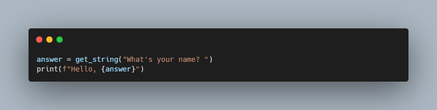

# Hello Python - CS50

### Description

Implemmnting a program that prints out a simple greeting to the user.

### How to use

python hello.py 

### Code Snippet

### Links

For more information about hello-python visit: 

---------------------------------
[cs50 course](https://cs50.harvard.edu/x/2023/psets/6/hello/)
---------------------------------------------------------------

